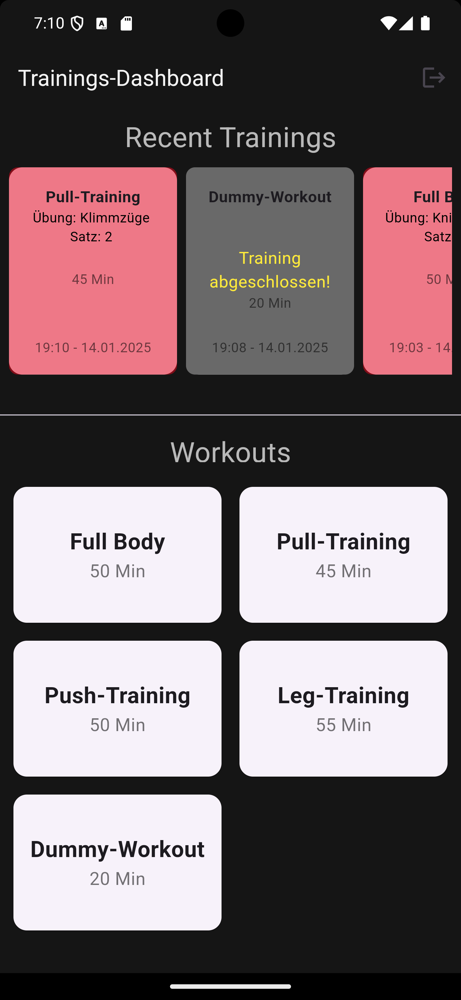

# mci_fitness_app

## Features

- **Login-Screen:** Anmeldung
- **Dashboard:** Überblick über mögliche Workouts und vergangene Trainingssessions.
- **Workout Detail:** Detaillierte Ansicht eines spezifischen Workouts.
- **Übung:** Einzelne Übung während des Workouts.
- **Pause:** Pause zwischen den Übungen oder Workouts verwalten.

## Bildschirmansichten

Hier sind die wichtigsten Screens der App:

### Login Screen

Der Login-Screen ist der erste Einstiegspunkt der App, wo Benutzer ihre Anmeldedaten eingeben.


### Dashboard

Das **Dashboard** zeigt eine Übersicht über alle aktuellen Workouts und deine Fortschritte. Hier kannst du auf verschiedene Workouts zugreifen.




### Workout Detail

Die **Workout Detail**-Seite zeigt alle Übungen des jeweiligen Workouts an und ermöglicht es den Benutzern, Details wie Sätze, Wiederholungen, Gewicht und Pausenzeit zu bearbeiten.


### Übung

Auf der **Übung**-Seite können Benutzer eine einzelne Übung hinzufügen, die Sätze und Wiederholungen definieren und das Gewicht festlegen.


### Pause

Die **Pause**-Seite ermöglicht es den Benutzern, Pausen zwischen Übungen oder Workouts zu verwalten und die Zeit zu überwachen.


## Installation

### Voraussetzungen

Stelle sicher, dass du Flutter und die erforderlichen Abhängigkeiten installiert hast:

```bash
flutter doctor
```

#### Schritt 1: Repository klonen

Klone das Repository auf dein Gerät:

```bash
git clone https://github.com/jonif-dev/MCI---Technical-Interview.git
```

#### Schritt 2: Abhängigkeiten installieren

Wechsel in das Verzeichnis des Projekts und installiere die Abhängigkeiten:

```bash
flutter pub get
```

#### Schritt 3: App starten

Starte die App auf einem Emulator oder Gerät:

```bash
flutter run
```

### Technologien

- **Flutter:** Framework für die plattformübergreifende App-Entwicklung.
- **Firebase:** Backend-Service für Authentifizierung und Datenspeicherung.
- **GetX:** Zur Verwaltung des Zustands und der Navigation.

Kontakt
E-Mail: jonasfiedler00@gmail.com
